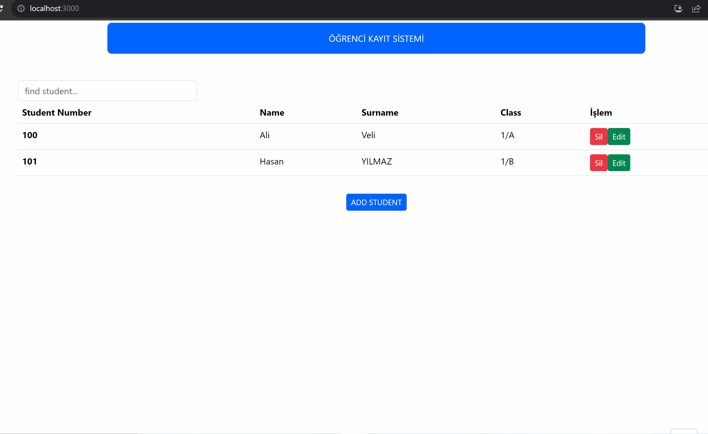

# STUDENT REGISTRATION SYSTEM (ÖĞRENCİ KAYIT SİSTEMİ) #

<ul>
  <li>Öğrenci Kayıt Sistemi için kullandığım teknolojiler: Javascript, React, Json-Server ve Axios kütüphaneleri.
  
  The technologies I use for the Student Registration System: Javascript, React, Json-Server and Axios libraries.
  </li>
  <li>
  Veritabanı olarak Json-Server Kütüphanesi kullanılmıştır. Axios Kütüphanesi ile veriler db.json dosyasından çekilmiştir.

  Json-Server Library was used as the database. Data was extracted from the db.json file with Axios.
  </li>
  <li>
  Modal yazarken pure css kullanılmıştır. Diğer kısımlardaki css işlemleri için Boostrap Kütüphanesi kullanılmıştır.

  Pure css was used when writing modal. Boostrap Library is used for css operations in other parts.
  </li>
  <li>
  Bu projede React Kütüphanesi kullanılmıştır. Crud diye isimlendirilen Create, Read, Update ve Delete işlemleri temelinde öğrenci bilgilerini kaydedebildiğimiz, silebildiğimiz ve düzenleyebildiğimiz bir uygulamadır. Ayrıca isme göre arama yapabilmekteyiz.

  React Library is used in this project. It is an application where we can save, delete and edit student information on the basis of Create, Read, Update and Delete functions called Crud. We can also search by name.
  </li>
</ul>

## Project gif file (Proje gif dosyası) ##

